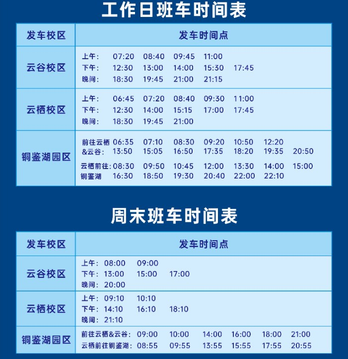

# 出行

> 去校园外的世界走走吧

西湖大学是一个 ~~由社会力量...~~ 离西湖很远的，离杭州很远的，离世界很远的地方。

云谷校区离西湖14.3公里，孤立杭州西北的边陲，充盈着城郊的孤寂。

以下是主要的出行方式。

--- 

### **地铁**

地铁大概是杭州最便捷的出行方式了，即使大学当下远离地铁站的接触，学子也不得不服膺向它奔赴。

#### 4号线池华街站(最近)

不提望梅止渴在建的西湖大学站，4号线池华街站拥有最近的距离。直线`3.1公里`不近不远，骑行和打车都是可能的方式。

- **骑行:适合大多数普通场合**。
骑共享单车至池华街D口。`4.2公里`，大约`15分钟`,骑行卡加持下`免费`。其实来回两趟还挺累的，就当出行必需的锻炼了。

- **打车:适合多人/行李/天气差**。
起步价的里程左右，`4.2公里`，车程大约`10分钟`，`8-10元`。可以看出汽车的速度并不能明显超出一个有出行向往的骑手，但劳累时是一个安逸的选择。

#### 其他线路

以下也是一些可选的选择。

- **5号线五常站**：路程`7.2公里`。公交车343路直达。
- **19号线荆长路站**: 路程`7.6公里`。荆长路上路线好记。如果凌晨1:30从校门步行出发，或许3:00能到。
- **19号线西溪湿地北站**：路程`8.8公里`。途径浙大，临近西溪，景象能缓解骑行前往的疲劳。
- **3/19号线杭州西站站**: 路程`9.6公里`。公交车349路直达。

---

### **公交**

学校门口的**西湖大学云谷校区站**

- **343路**：池华街站-学校-仓前。`3元`
- **349路**：三墩站-学校-火车西站。`2元`

---

### **校车**

> 穿梭城南的便捷魔法！

云谷(A1楼后)-云栖(南门旁)。约`45min`，`免费`。要刷卡，记得带校卡。

云栖附近地点参考：6号线科海路站(900m)、铜鉴湖公园(2.2km)、之江文化中心(4.7km)。

**班车表**:（节假日可能调整）

---

### **打车**

除了**贵**几乎没有缺点。

---

### **高铁**

#### 杭州西站(最近)

> 周末出游的极佳选择。[西湖大学-苏州南]=[西湖大学-西湖]=1.5h

直线`6.8公里`,路程`9.6公里`。

公交车*349路*直达。约`40分钟`。运气好可以坐上*349路快线*，走高架能再省一些时间。

打车车程约`13分钟`,**飞快**！费用约`15-18元`。

- **宁杭高铁**：
  杭州西-湖州(22min)-宜兴(41min)-粟阳(54min)-南京(1h22min)-合肥(2h13min)

- **合杭高铁**：
  杭州西-安吉(36min)-宣城(1h1min)-芜湖(1h28min)-合肥(2h9min)

- **杭黄高铁**：
  杭州西-富阳西(13min)-桐庐东(19min)-千岛湖(48min)-黄山(1h26min)

- **杭温高铁**：
  杭州西-义乌(41min)-横店(55min)-温州(1h30min)

- **沪苏湖高铁**
  杭州西-德清(14min)-苏州南(43min)-上海(1h23min)

#### 杭州东站

地铁4/19号线直达。最大的火车站，人多。

#### 杭州站

慢车为主。适合卧铺，睡一觉就到目的地了。

#### 杭州南站

远，前往不便。